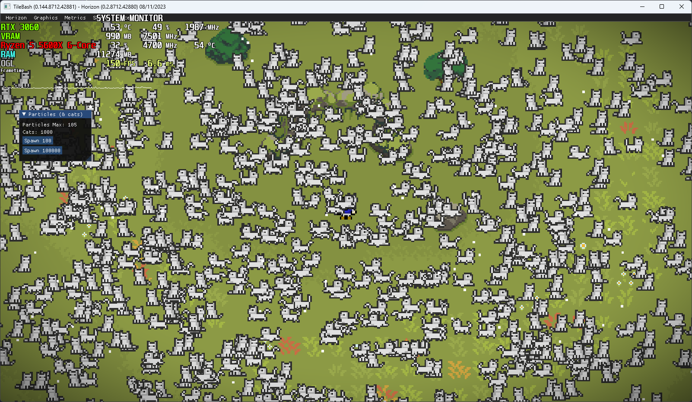
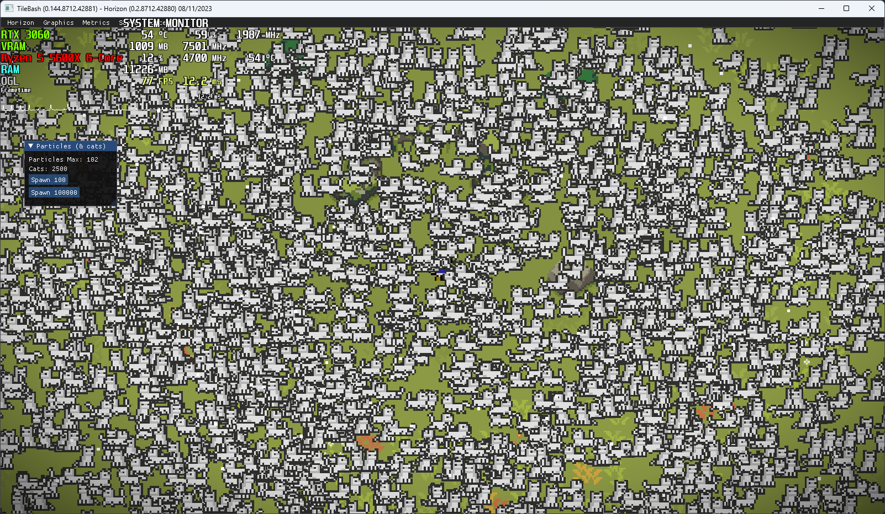
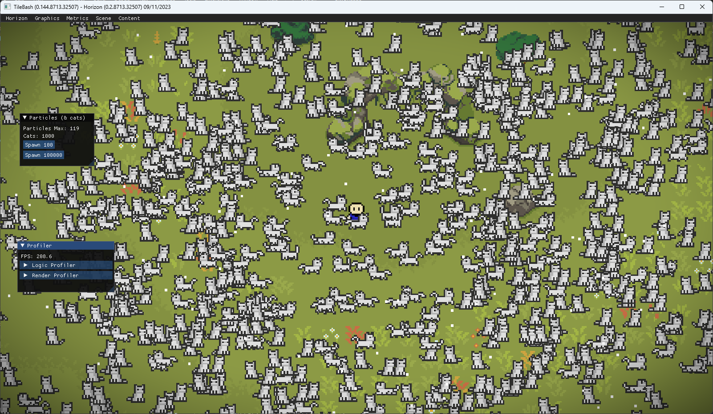
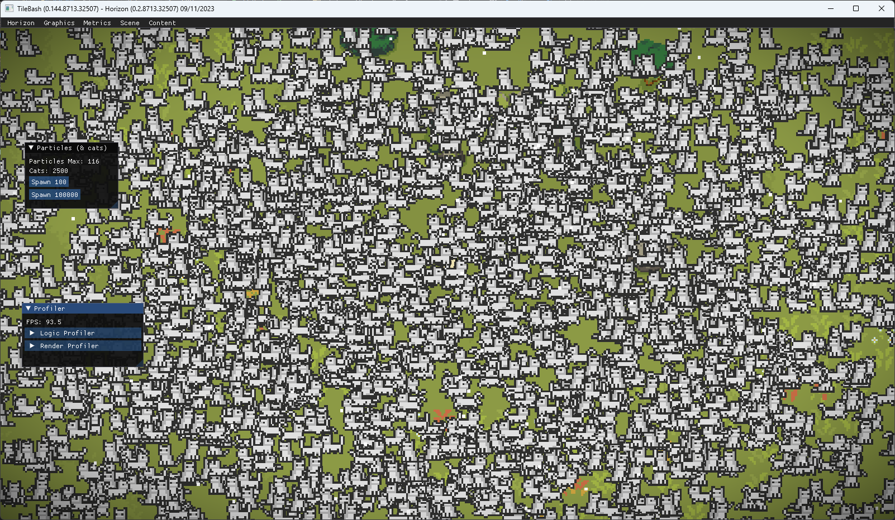
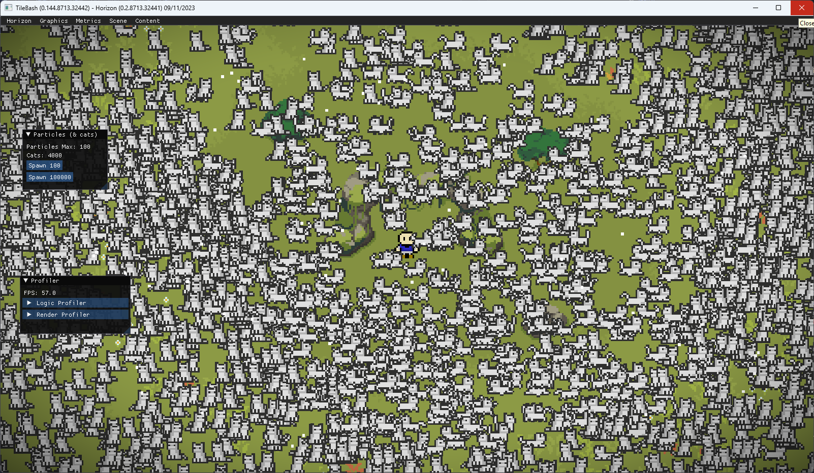

# Intro
Im writing this mostly due to my incompetent memory but also because I wanna look back in the future and think "wow, this guys an idiot"

So first things first before we write any code we need to define what a spritebatch is and if its even useful what it accomplishes and how useful it actually is (why bother learning something impractical right?)

In the context of game engines, a spritebatch is the colloquial term for an object that batches together the rendering procedures associated with rendering a large quantity of smaller sprites, efficiently. And theres the rub, that word, 'efficiently', 11 letters that can drive a man insane, or rather drive him to write about it??? Anyways, lets get into the introduction.

# Actual Intro
A few years ago when I ditched SFML and went a level lower into OpenGL I gullably assumed a spritebatch simply takes the data required to render each individual sprite (vertex and element) and aggregates them into a single vertex array and just glDrawArray my way into high performance graphics. But this was barely enough, in fact it *wasn't* enough, so whats the next step? Well thats why im writing all of this, I need to log all my data somewhere, because between rewriting my rendering backend every other month and forgetting the reason I started to begin with, I need to serialize some actual data.
## Possible approaches
OpenGL offers several processes to actually render your geometry, in terms of ultra high performance, approaching nearly zero driver overhead, there are techniques such as indirect drawing and instancing, or hell the mother of all gl calls, glDrawArraysInstancedBaseInstance() which essentially combines instancing, element buffering and indirect drawing into a single beast of a call, but this function is for rendering a large quantity of an array of unique meshes with per instance data _indirectly_, which is absolutely stunning (in my eyes); so thats the answer my question right? Well no, in my specific case using too overkill a technique can result in lower throughput due to driver/OpenGL overhead. So ultimately this entire process comes down to benchmarking and combining different types of buffering, instancing (or not) or plain vertex array manipulation, so let me briefly list some ways ive thought off to solve this issue:

1. Use a uniform buffer to pass in a large array of transform matrices each frame
2. Streaming the transforms into a shader storage buffer.
3. Simply baking the model transforms into the vertex buffer each frame and streaming that.
4. Maybe instead of using a vertex array to aggregate all the individual meshes I should instead use instancing to minimize memory i/o because at a certain threshold amount of sprites surely the 4 vertices and 6 indices add up to more than simply passing in a single transformation matrix and texture coordinates.
5. Using a geometry shader to generate meshes on the fly, these days they are not as slow (they absolutely are I simply mentioned this to prove I looked at all angles).
6. Maybe baking the transformation matrix into the vertex buffer at render time each frame in a compute shader and using a shader storage to save on i/o.

#### Batching
Its the first word, however we can also design our sprite batch to specifically batch together groups of sprites, this may be to divide them into a chunk system (rather use a quad tree) therefor opening the door to full blown realtime dynamic culling for further optimization, with this said, at lower sprite counts is it more or less efficient to batch render sprites depending on texture, where is the critical point between memory speed limitations, GPU texture switching limitations and the dread of my soul bare, caching.

7. Splitting sprites into batches (such as by texture to avoid texture switching, proximity for culling, etc.) and render smaller groups with finer control of rendering parameters, hopefully increasing performance at higher sprite counts.
8. breaking my strict OOP conventions and using a more functional array-of-structs paradigm to greatly improve caching performance (remember this***)

X. Finally, using a more vanilla (lame) approach and simply baking everything into the vertex buffer for all sprites and simply stich a large texture atlas with each sprites sprite sheet.

# Current Implementation
### Obligatory rant
I started targeting OpenGL 3.3 core (because of my childish obsession with MacOSX compatibility) and hence was really set back by the lack of shader storage buffers (uniform buffers have a really disappointing size limit), but since then I have been (successfully) lead to temptation by seeing modern Vulkan, and decided to just give GL4.6 a shot, and whoah. Without accidentally ranting about things like direct memory access and compute shaders, nevermind, in around 2 hours I was able to not only learn enough about compute shaders to create a instanced particle renderer using shader storage buffers, but I was able to achieve over 300FPS on my 3060 with 1024^2 particles, which is inspiring, I plan to transition as much mesh generation to the GPU as possible. Man just thinking about all these new features just juices my dopamine receptors.

### Actual implementation
Horizon's current sprite batch implementation batches sprites by texture and only updates their vertex data when a sprite is added or remove from the sprite batches scope, on a per frame basis a shader storage buffer is updated with the model transformation matrices and frame offsets (for animated sprites), and with this I am able to render 2500 cats at around 70FPS and 1000 cats at 180FPS.




However, be it my lazyness or some other force guiding me towards optimization, I need to do better! My first instinct is something I've only seen on paper, and thats the AZDO (approaching zero driver overhead) technique called persistent buffering, it allows one to map a region of memory once and keep the pointer, and the driver will handle when the data is uploaded, this is in contrast to my current technique in which I have a struct array which I populate with sprite rendering data (model transforms and frame offsets), I then check if the buffer size has changed (ie. a sprite was added or removed) and then either glBufferData or glBufferSubData, however there is a compounded overhead between aggregaring the sprite data and then copying it all over to the GPU, so I look forward to trying it out, let's see how this all works, and lets see some actual code!

## Current Implementation

```c#
...
public void Render(...in ReadOnlySpan<Sprite> sprites...)
{
    // Setup state and prepare shader uniforms.
    ...

    // This is the actual meat of the function.
    UniformBuffer.BufferData(AggregateSpriteData(sprites));
    
    // Actually render the vertex array.
    ...
}
/// <summary>
/// Helper func to update the struct[] we copy to the GPU.
/// </summary>
private SpriteData[] AggregateSpriteData(in ReadOnlySpan<Sprite> sprites)
{
    // Perhaps swapping out for a Parallel.For or a custom thread pool implementation?
    for (uint i = 0; i < sprites.Length)
    {
        data[i] = new SpriteData
        {
            modelMatrix = sprites[i].Transform.ModelMatrix,
            spriteOffset = sprites[i].GetFrameOffset()
        };
    }
    return data;
}
...
```
At first glance there are obvious optimizations we can make, for starters we can ditch this seperate structs array, if we are smart about things we can transition the entire sprite batch rendering system to have an array-of-structs data driven approach, however I don't like this for many reasons, my main deal breaker is that the object and the data are seperated. However I feel like we can work our away around this problem, firstly we can implement a persistent buffer, to which we can write our sprite data into each frame, we need to track and appropriatly resize the buffer as the number of sprites changes, but other than that there really isn't that much else to change.

## The shiny new AZDO technique
```c#
public void Draw()
{
    ...

    if (sprites.Length > bufferLength) // Check if array has been resized.
    {
        bufferLength = (uint)sprites.Length;

        storageBuffer.UnmapBuffer();
        dataPtr = (SpriteData*)
            storageBuffer.MapBufferRange(
                (nuint)(bufferLength * sizeof(SpriteData)),
                MapBufferAccessMask.WriteBit | MapBufferAccessMask.PersistentBit
            );
    }
    AggregateSpriteData(in sprites);

    ...
}
private unsafe void AggregateSpriteData(in ReadOnlySpan<Sprite> sprites)
{
    for (int i = 0; i < sprites.Length; i++)
    {
        dataPtr[i].modelMatrix = sprites[i].Transform.ModelMatrix;
        dataPtr[i].spriteOffset = sprites[i].GetFrameOffset();
    }
}
```
As you can see it's really not that hard (specifically because i've ommited the syncing code, but thats because _i haven't written it yet_) however I am yet to implement buffer mapping natively into my BufferObject class, so for now I'm using a seperate implementation. Lets look at the improvement:

## 1000 Cats @ 200+ FPS  

## 2500 Cats @ 90+ FPS

## 4000 Cats at ~60 FPS

